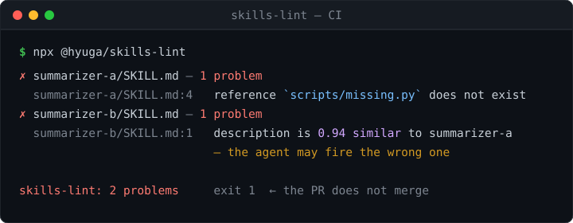

# skills-lint



> One of three zero-dependency linters for AI-agent repos. To run all three in a single pass, with one report and one exit code, use **[tenken](https://github.com/hyuga611/tenken)** — `npx @hyuga/tenken`.

**Your Agent Skills (`SKILL.md`) probably lie, or shadow each other. Catch it in CI.**
`skills-lint` is a zero-dependency, language-agnostic linter for [Anthropic Agent Skills](https://www.anthropic.com/news/skills). It fails your PR when a `SKILL.md` references a script/file that doesn't exist, or when two skills collide — same `name`, or descriptions so similar the agent can't tell which to fire.

**あなたの `SKILL.md`、存在しないスクリプトを指したり、別スキルと発火が被っていませんか？**
Anthropic Agent Skills 用の依存ゼロ・言語非依存リンタ。**参照整合**（本文が指すファイルの実在）と**衝突検出**（`name` 重複・`description` の近すぎ＝トリガ取り違え）を CI で毎PR落とす。

---

## Tried on real code / 実データに当てた

A random sample of **2,465 skills published on [ClawHub](https://clawhub.ai)**, drawn from 69,265
enumerated (August 2026, seed `20260804`):

| | |
|---|---|
| declared `name` differs from the registry slug | **29.2%** |
| `SKILL.md` ships with no YAML frontmatter at all | **7.1%** |

Plus the **46 skills bundled in [openclaw/openclaw](https://github.com/openclaw/openclaw)**, where
one skill tells the agent to read `../openclaw-docs/SKILL.md` — a skill that does not exist.

That run was also the harshest test of this linter. It first reported **201 errors for 13 real
defects** on the openclaw corpus. Four precision bugs were fixed before publishing any number:
repository-wide reference resolution, model ids (`openai/gpt-5.4`) read as file paths, artifacts
excused only on the line that creates them, and indented frontmatter losing every key. Unknown
frontmatter keys are now a warning, not an error — the Agent Skills standard requires runtimes to
ignore keys they do not recognise. Every case is pinned in [`test/realworld.test.mjs`](test/realworld.test.mjs).

## What it checks / 何を見るか

- **Referential integrity** — back-quoted paths and `[text](path)` links in the body (`scripts/`, `references/`, `assets/`) must exist on disk. Language-agnostic.
- **Frontmatter** — `name` present and `^[a-z0-9-]+$` (≤64 chars), `description` present (≤1024 chars).
- **Metadata schema** — unknown-key typos (`allowed_tools` → suggests `allowed-tools`), `allowed-tools` format, `name` matching the skill's directory name, plus nested `metadata:` validation and duplicate-key detection.
- **`references/` cross-links** — markdown files under a skill's `references/` are scanned too; their internal links and script references must resolve.
- **Collisions across skills** — duplicate `name` (install clash), and `description` pairs that are near-duplicates (character-bigram similarity ≥ 0.7 → the agent mis-fires between them). Works for Japanese and English triggers.

## Use as a GitHub Action / CIで使う（定着の本体）

```yaml
# .github/workflows/skills-lint.yml
name: skills-lint
on: [push, pull_request]
jobs:
  skills-lint:
    runs-on: ubuntu-latest
    steps:
      - uses: actions/checkout@v4
      - uses: hyuga611/skills-lint@v1
        with:
          paths: .claude/skills   # optional; defaults to .claude/skills / skills
```

Findings show up as inline PR annotations and the job fails (exit 1), so a broken or colliding skill can't be merged.

## Use as a CLI / ローカルで使う

```bash
npx @hyuga/skills-lint                          # .claude/skills / skills を自動探索
npx @hyuga/skills-lint path/to/skills           # ディレクトリや SKILL.md を指定
npx @hyuga/skills-lint --threshold 0.8          # 衝突判定のしきい値を変更（既定 0.7）
npx @hyuga/skills-lint --allow legacy-a,legacy-b # 指定スキルは衝突検査から除外
# npm i -g @hyuga/skills-lint すると `skills-lint` コマンドで使えます
```

## Why collisions matter / なぜ衝突が問題か

Skills fire from their `description`. Ship two skills whose descriptions overlap on the same trigger and the agent picks the wrong one — silently. `skills-lint` surfaces that pair before merge. (Duplicate `name`s simply clash on install.)

## Dev

```bash
node --test                          # unit tests
npm run poc                          # examples/bad で検出デモ → exit 1
node src/check.mjs examples/good     # 正しい例を検査 → exit 0
```

## Roadmap

- [x] Referential integrity of `SKILL.md` body references (zero-dep) — `src/check.mjs`
- [x] Name-collision + description near-duplicate (language-agnostic bigram similarity)
- [x] **GitHub Action** (`action.yml`) + inline PR annotations + self-CI
- [x] Configurable similarity threshold + allowlist (`--threshold` / `--allow`, or `SKILLS_LINT_THRESHOLD`)
- [x] Frontmatter metadata schema — unknown-key typos, `allowed-tools` format, `name`↔directory match
- [x] `references/` cross-link integrity + nested `metadata:` schema & duplicate-key detection

## Related tools

Zero-dependency CI linters for repos where AI agents do the work. Each one fails the PR on something that breaks quietly.

| | Catches |
| --- | --- |
| **[tenken](https://github.com/hyuga611/tenken)** — start here | Runs reflint + skills-lint + carrylint over one tree: one report, one exit code, one Action |
| [reflint](https://github.com/hyuga611/reflint) | `AGENTS.md` / `llms.txt` / `CLAUDE.md` pointing at commands, scripts, or paths that no longer exist |
| **skills-lint** ← you are here | `SKILL.md` broken references + `name`/trigger collisions between skills |
| [carrylint](https://github.com/hyuga611/carrylint) | Skills with the author's machine or model baked in — absolute paths, undeclared CLIs, unresolved placeholders |
| [genchi](https://github.com/hyuga611/genchi) | Agents reporting "done" without re-fetching real-world state |
| [tracklint](https://github.com/hyuga611/tracklint) | Forms and CTAs that quietly stopped being wired for conversion tracking |
| [tokenlint](https://github.com/hyuga611/tokenlint) | Hardcoded colors that bypass your design tokens |
| [reflint for VS Code](https://github.com/hyuga611/reflint-vscode) | The same reflint checks, inline in the editor as you save |
| [orogami](https://github.com/hyuga611/orogami) | Not a linter — natural Japanese/CJK line breaking for OGP images (BudouX + font subsetting) |

MIT
